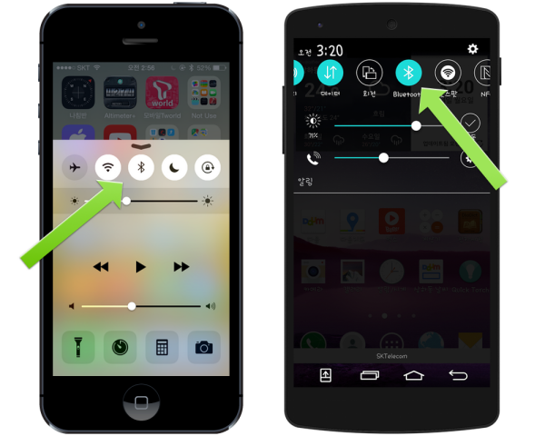
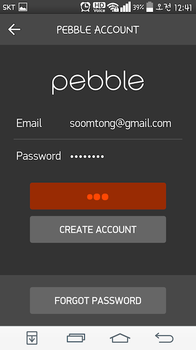
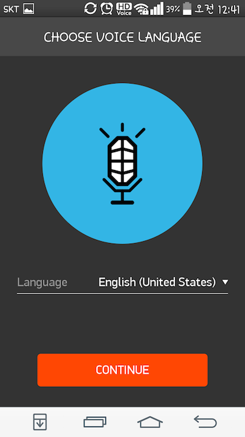
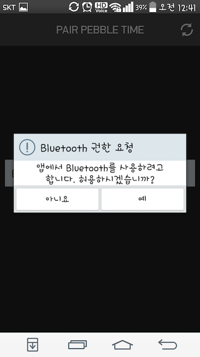
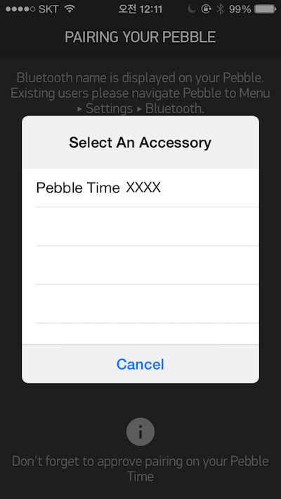
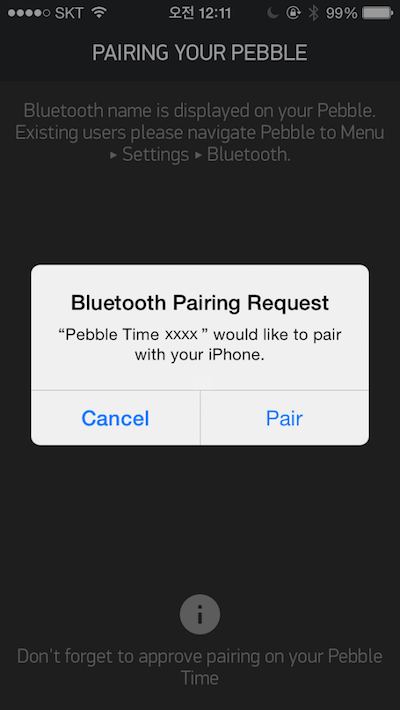
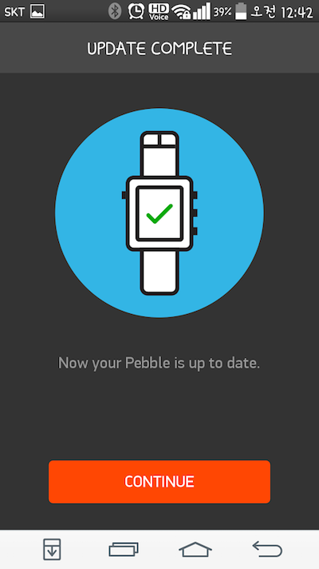
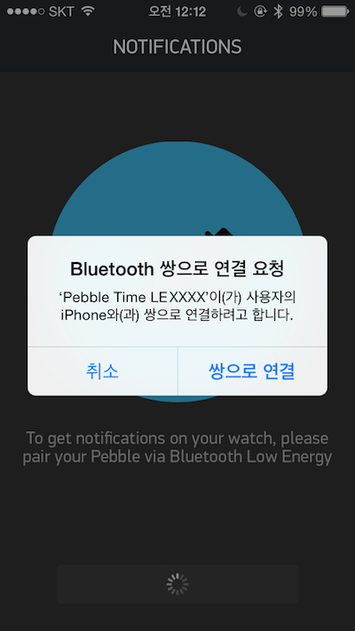
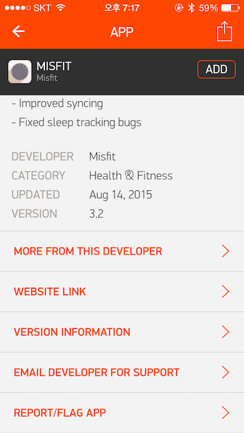
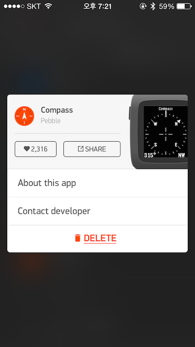

```
title: 한눈에 보는 페블 사용자 가이드
author: soomtong
```

페블(Pebble, 이하 페블)은 페블 테크날러지에서 2012년 말 클라우드 펀딩 사이트 **킥스타터** 를 통해 자금을 모아 시작된 스마트와치 프로젝트입니다. 창업자는 에릭 미기코프스키(Eric Migicovsky)이며 페블 이전에 비슷한 스마트기기를 개발하였습니다.


페블 스마트와치 개요
--------------------

현재까지 페블은 컬러가 도입된 2015년을 기준으로 크게 두 종류로 구분할 수 있습니다. **페블 클래식**과 **페블 타임** 으로 나눌 수 있습니다.

그리고 제품의 재질에 따라 **스틸**이라는 꼬리말이 붙는 금속 케이스를 사용한 버전을 포함해 현재 **페블**, **페블 스틸**, **페블 타임**, **페블 타임 스틸** 이렇게 4 종류의 페블이 있습니다. (이하 페블 클래식은 페블 오리지널과 페블 스틸 버전을 말하며, 페블 타임은 페블 타임과 페블 타임 스틸 버전을 지칭합니다.)


### 타기기와 비교

스마트와치의 선두격인 애플와치와 비교하여 장단점을 살펴보면 다음과 같습니다.

#### 장점

-	상대적으로 저렴한 가격
-	상시 대기중인 화면
-	비교적 긴 배터리 사용 시간
-	직관적인 버튼 인터페이스
-	훌륭한 방진 방수 기능
-	iOS 와 안드로이드 동시 지원

#### 단점

-	낮은 해상도와 부족한 색상
-	기약이 없는 다국어 지원
-	비교적 완벽하지 않은 SDK
-	사운드 알림 불가능
-	약간 뒤쳐진 디자인

전화 수신이나 문자 수신과 같은 대부분 기본적인 노티피케이션이 가능하고 별도의 장치 없이 항상 화면이 보여지는 안정감이 있습니다. 다른 액정과 다르게 픽셀을 변경할 때만 전력이 사용되는 전자 잉크 기반의 디스플레이를 가지고 있기 때문입니다. 이에 따라 흑/백 또는 제한된 색상만 출력이 가능한 단점을 가지고 있기도 합니다.

그리고 일반적인 사용시 5~7일 까지도 사용가능한 배터리 타임과 상대적으로 저렴한 가격이 매력적이라 볼 수 있습니다.

현재 유저들의 평가를 보면 위 두가지 장점 때문에 나머지 단점을 극복하고 있다고 봐도 과언이 아닙니다.

애플이나 구글 같은 큰 기업이 아님에도 불구하고 여전히 소프트웨어 업그레이드가 진행되고 있으며 휴대폰을 확인하는 빈도를 줄여주는 목적에 최적인 스마트 디바이스라고 추천할 수 있습니다.

### 하드웨어

터치스크린 대신 총 4개의 버튼을 가지고 있으며 출시 시기에 따라 약간의 차이가 있습니다.


항상 화면이 보이는 E-Paper 디스플레이를 사용하고 있으며 올해 출시한 페블 타임부터 컬러 디스플레이를 사용합니다.

| 구분        | 페블 클래식         | 페블 타임                |
|:------------|:--------------------|:-------------------------|
| 출시        | 2013년              | 2015년                   |
| 무게        | 37g                 | 42.5g                    |
| 밴드        | 22 mm               | (좌동)                   |
| 디스플레이  | 1.26" 흑백+백라이트 | 1.25" 64 컬러+백라이트   |
| 해상도      | 144 x 168 (176 PPI) | 144 x 168 (182 PPI)      |
| 피드백      | 전동 모터           | (좌동)                   |
| 센서 1      | 지자계 센서(나침반) | (좌동)                   |
| 센서 2      | 주변 광센서         | (좌동)                   |
| 센서 3      | 가속도(3축) 센서    | (좌동)                   |
| 블루투스    | 2.1 + 4.0(EDR, LE)  | (좌동)                   |
| 오디오 입력 | 없음                | 방수 마이크              |
| 방수        | 5기압 / 40미터      | (좌동)                   |
| 프로세서    | ARM Cortex-M3       | ARM Cortex-M4            |
| 메모리      | 512 KB              | 1014 KB                  |
| 스토리지    | 8MB                 | 16 MB + 1MB(System)      |
| 베터리      | 130mAh              | 150mAh                   |
| 확장        |                     | 스마트스트랩을 통한 확장 |

5V 의 전원에 페블 전용 케이블로 연결되어 충전되며 충전 포트는 클래식 페블은 측면에, 페블 타임은 후면에 마그네틱 접착 방식으로 제공됩니다.

### 소프트웨어

FreeRTOS 에 기반한 페블 OS 가 설치되어 있으며 2015년 현재 페블, 페블 스틸을 위한 2.X 대의 SDK 와 페블 타임, 페블 타임 스틸을 위한 3.X 대의 SDK 를 제공하고 있습니다.

개발 툴은 대부분 공개되어 있으며 임베디드 기기답게 C (C99/C11) 를 메인 언어로 사용합니다.

| 구분               | 페블 클래식      | 페블 타임        |
|:-------------------|:-----------------|:-----------------|
| 플랫폼             | Aplite (SDK 2.x) | Basalt (SDK 3.x) |
| 프로그램 코드 제한 | 24kB             | 64kB             |
| 리소스 제한        | 96kB             | 256kB            |

프로그램은 와치페이스 모드와 와치앱 모드로 나뉘어져 제공되고 있습니다. 와치 페이스 앱은 버튼을 통한 제어가 불가능하며 와치페이스 셀렉터를 통해 여러 개의 와치페이스 중 하나를 선택할 수 있습니다. 3.X 대의 SDK 에 추가된 타임라인 개념에 맞춰 새로운 인터페이스가 제공되고 있습니다. 와치페이스를 중심으로 이전에 발생한 이벤트와 다음에 발생할 이벤트에 대해 탐색이 가능합니다.


와치앱은 버튼 컨트롤을 포함한 모든 기능을 사용할 수 있는 애플리케이션입니다. 타임라인 인터페이스를 벗어나 실행되기 때문에 독립적인 애플리케이션 환경을 제공한다는 느낌을 받게 됩니다.

별도의 개발자 등록 비용 없이 개발환경을 꾸려 자신의 페블 애플리케이션을 만들어 사용할 수 있습니다. 개발자 메뉴얼은 비교적 잘 갖춰져 있으나 아직 심도 있는 내용들이 공개되지 않아 애를 먹는 경우도 있습니다.

유니코드 기반의 라틴계열의 문자열을 공식 지원하고 있으며 SDK 가 포함된 펌웨어를 조합하고 추출하는 방법이 유능한 개발자들의 노력에 의해 공개된 후 비 라틴 계열 언어의 비공식 언어팩을 사용하여 한글을 포함한 다른 언어를 사용할 수 있게 되었습니다.

펌웨어의 버전에 따라 비공식 언어팩의 작동이 일정하지 않아 커뮤니티의 분노를 유발하기도 했습니다. 열린 생태계의 기술이 그렇듯 유능한 개발자에 의해 해결이 되기도 합니다.

페블에서 사용할 수 있는 애플리케이션을 JavaScript 로도 만들수 있다하지만 항상 아이폰이나 안드로이드 기기가 접속되어 있어야 하기 때문에 배터리 사용에 제약을 받게 됩니다. 또한 완성도가 높지 않아 시행착오를 겪을 확률이 높습니다.


페블 구입하기
-------------

페블은 아직 국내에서 직접 구입할 방법이 없습니다. 페블 본사의 홈페이지를 통해 주문할 수 있으며 필요에 따라 배송 대행 서비스를 사용하여 구입할 수 있습니다.

현재 페블의 4가지 모델은 각각 다른 가격으로 판매되고 있습니다. 홈페이지를 통해 가격을 확인해주세요.

**[페블 공식 홈페이지](https://getpebble.com/)** | https://getpebble.com/


경우에 따라 온라인 장터를 통해 구입할 수 있으니 스마트 기기 관련 커뮤니티의 중고 장터 등을 통해 손에 넣는 방법도 나쁘지 않습니다.

-	[클리앙](http://www.clien.net/cs2/bbs/board.php?bo_table=sold) | http://www.clien.net/cs2/bbs/board.php?bo_table=sold
-	[페이스북](https://www.facebook.com/groups/Pebble.Korea) | https://www.facebook.com/groups/Pebble.Korea
-	[네이버 중고나라](http://cafe.naver.com/joonggonara) | http://cafe.naver.com/joonggonara
-	그 외 온라인 전자기기 커뮤니티 참고

기본 조작법
-----------

페블은 크게 와치페이스 모드, 와치앱 모드, 시스템 메뉴 모드로 구분할 수 있습니다. 대부분의 인터페이스는 버튼을 통해 페블을 조작할 수 있습니다. 특별히 와치페이스나 와치앱에 따라 흔들기, 뒤집기 등을 통해 제어가 되는 경우도 있습니다.

### 버튼 사용법


#### 와치페이스 모드

와치페이스 상태일 경우 다음과 같이 사용할 수 있습니다.

-	뒤로 : (아무 작동하지 않습니다)
-	위로 : 지난 타임라인 이벤트 보기
-	아래로 : 다음 타임라인 이벤트 보기
-	선택 : 시스템 메뉴 이동


#### 와치앱 모드

와치앱 모드에서는 와치앱에 세팅된 대로 조작할 수 있습니다. 와치앱은 뒤로 버튼을 제외한 모든 버튼 조작에 대해 접근할 수 있습니다. (개발자는 한 번 클릭, 오래 클릭 ,두 번 클릭 등의 기능을 적용할 수 있습니다.)

-	뒤로 : 앱 종료, 오래 누르면 앱 강제 종료
-	그 외 버튼 : 해당 와치앱에서 세팅된대로 조작됩니다.


#### 시스템 메뉴 모드

페블의 메인 메뉴 상태일 경우 다음과 같이 버튼을 사용할 수 있습니다.

-	뒤로 : 상위 메뉴로 이동 또는 시스템 메뉴 종료, 종료 후 선택된 와치페이스로 이동합니다.
-	위로 : 메뉴 위로 이동
-	아래로 : 메뉴 아래로 이동
-	선택 : 선택된 항목의 하위 메뉴로 이동 또는 해당 항목 실행


#### 단축키 지정

와치페이스 상태에서 위 버튼과 아래 버튼을 오래 누르는 것으로 앱 단축키를 지정할 수 있습니다.

시스템 메뉴에서 단축키 지정 항목을 선택합니다.

 

위 또는 아래 버튼을 선택합니다. 해당 버튼에 지정할 와치앱을 선택합니다.

 

확인 과정을 거쳐 바인딩을 완료합니다.

이렇게 위 버튼과 아래 버튼에 필요한 앱을 연결해 줍니다.

연결이 완료된 후 와치페이스 모드에서 해당 버튼을 오래 누르고 있으면 지정된 앱이 실행됩니다.

-	위로 (오래 누르기) : 지정된 와치앱 즉시 실행
-	아래로 (오래 누르기) : 지정된 와치앱 즉시 실행

#### 강제 리부팅 / 공장 초기화

필요에 따라 페블 시스템을 강제 종료해야하는 경우가 생기기도합니다.


-	뒤로 + 위로 + 선택 : 이 3개의 버튼을 동시에 오래동안 누르면 페블 시스템이 리부팅 됩니다. 리부팅이 불가능 할 정도로 시스템이 손상되었다면 공장 초기화 과정을 진행합니다.

### 모션 사용법

페블을 흔들게 되면 백라이트가 켜집니다. 시스템 메뉴에서 백라이트 세팅값을 설정할 수 있습니다. 그 외 각 와치앱에 따라 준비된 기능이 실행되거나 활성화되기도 합니다.

#### 백라이트 설정

 

선택 버튼을 눌러 모션 센서를 켜고 끌 수 있습니다. 백라이트의 지속 시간도 설정 가능합니다.

스톡 애플리케이션 & 페어링
--------------------------

아이폰이나 안드로이드 장치에 설치되는 페블 애플리케이션을 **스톡 애플리케이션** 이라고 부릅니다. 애플 앱스토어나 구글 플레이스토어에서 페블 모델에 따른 스톡 애플리케이션을 설치해주세요.

키워드는 `pebble` 로 검색하면 다음과 같은 아이콘을 확인할 수 있습니다.


구버전의 페블을 위한 앱과 페블 타임 이후의 앱이 구분되니 해당 기기에 맞는 앱을 설치해주세요.


페블에 다양한 앱을 설치하거나 페블을 관리하기 위해 페블 전용 애플리케이션을 사용해야 합니다. 그 전에 해당 기기와 연결을 진행해야 하는데 이 과정을 **페어링** 이라고 합니다.



자신의 기기에 블루투스가 켜져 있는지 확인 후 비활성화 상태라면 블루투스를 켜 주세요.

### 최초 연결시 또는 초기화 후 연결시

바다 건너 페블이 도착해 이제 막 포장을 뜯었거나 페블 시스템 메뉴를 통해 **펙토리 리셋** 을 한 뒤라면 펌웨어 체크 및 스톡 애플리케이션과 연결을 해달라는 화면이 나타납니다.

 

페블이 펌웨어를 세팅할 준비가 되면 최초 접속을 위해 다음과 같은 상태로 대기합니다.


블루투스가 활성화되어 있는 기기의 스톡 애플리케이션을 실행해 페어링 과정을 시작합니다.

구글 플레이스토어나 아이폰 앱스토어에서 스톡 애플리케이션을 설치해주세요.


스톡 애플리케이션이 최초 실행될 때 페블에 등록된 아이디와 패스워드가 필요합니다.


계정을 생성하고 로그인(SIGN IN)을 진행합니다.


계정이 없다면 새로 생성(CREATE ACCOUNT)해주세요.




아직은 한국어를 지원하지 않습니다.



만약 블루투스가 비활성화 되어있다면 블루투스 사용을 요청합니다.



스톡 애플리케이션이 설치된 기기의 상태 창 또는 경고 창이 페블의 고유한 이름과 함께 접속을 요구하는 경우 승인해 주세요.







블루투스 연결이 완료되면 페블에 설치된 펌웨어의 버전을 확인하고 필요한 경우 업데이트를 진행합니다.




이어서 페블 화면에 나타난 접속 요청에 버튼을 '위로' 눌러 완료합니다.

~~[페블의 커넥션 요청 이미지]~~

추가로 아이폰의 경우 블루투스 LE 모드를 활성화 하기 위한 페어링 과정이 한 번 더 진행됩니다. 처음 연결과 마찬가지로 접속 요구를 승인합니다.




~~[페블의 커넥션 요청 이미지]~~

마찬가지로 페블 화면에 나타난 접속 요청에 해당 버튼을 눌러 완료합니다.

기기에 따라 푸시 메시지 노티피케이션을 위한 세팅을 요청하기도 합니다. 페블 스톡 애플리케이션에게 필요한 권한을 승인해 주세요.


이어 모든 작업을 마치면 다음과 같은 화면을 만날 수 있습니다.


### 연결이 완료된 상태의 페블 블루투스 메뉴

블루투스 접속이 정상적으로 완료 되었을 경우 블루투스 메뉴는 아래와 메뉴 구조를 가집니다.


아이폰의 경우 페블은 두 개의 블루투스 연결을 가지고 있습니다.

-	스톡 애플리케이션이 앱 설치/전송 시 사용하는 **블루투스** 연결
-	메시지(전화 수신, 문자 수신, 일반 알람 수신 등의 노티피케이션 메시지) 통신을 위한 **블루투스 LE** 연결


아이폰의 경우 블루투스 LE 상태만 접속된 경우에는 다른 메시지가 나타납니다. 이 경우 노티피케이션은 받을 수 있으나 와치페이스나 와치앱을 설치하거나 삭제할 수 없습니다.


블루투스 메뉴를 연결정보가 저장된 기기를 삭제할 수 있습니다. 연결정보가 저장된 기기의 항목을 선택해 삭제 메뉴를 통해 연결정보를 제거합니다.

#### 블루투스 접속 정보 삭제

페블 메인 메뉴로 이동 후 블루투스 메뉴에서 접속되어 있는 기기로 위 아래 버튼을 통해 이동 한 후 선택 버튼을 눌러 삭제합니다. 뒤로 버튼을 누르면 취소됩니다.

### 다른 기기로 연결

필요에 따라 다른 기기와 페어링을 할 필요가 있습니다.

-	아이폰 사용자가 커스텀 펌웨어나 언어팩을 설치할 경우 안드로이드 기기와 연결해야 합니다.

두 대 이상의 기기에서 연결해 사용하지만 단 하나의 스톡 애플리케이션과 통신할 수 있습니다. 페블이 다른 기기와 접속되면 이전에 접속된 연결은 해제됩니다.

#### 다른 기기로 연결하기 위한 과정

페블이 다른 기기와 접속할 수 있도록 블루투스 메뉴에서 상태를 변경하면 새로운 기기와 페어링할 수 있습니다.


이 상태에서 다른 기기와 접속을 시도한 후 일반적인 블루투스 연결과정을 진행해주세요.


일반적인 순서를 정리하면 다음과 같습니다.

1.	페블의 세팅 메뉴로 이동 후 블루투스 메뉴로 들어갑니다.
2.	위/아래 버튼을 사용해 'Connection' 메뉴에서 다른 곳으로 이동합니다.
3.	다른 아이템으로 이동을 마치면 커넥션 메뉴에 다른 메시지(Now Discoverable)가 나타납니다.
4.	새로 접속할 기기의 페블 스톡 애플리케이션을 실행합니다.
5.	이전에 설명한 블루투스 연결 과정을 진행합니다.
6.	새로 접속한 기기의 접속 요청과 페블의 접속 요청을 모두 승인합니다.
7.	페블의 블루투스 메뉴에 추가된 기기를 확인합니다.

이렇게 두 대 이상의 블루투스 기기를 페블과 연결할 수 있습니다.


### 재접속시

어떤 이유로 접속이 끊긴 상황이라면 '다른 기기로 연결' 방법을 시도해 재접속을 진행해 주세요. 만약 이 과정을 통해 재접속이 되지 않는다면 접속 정보가 저장된 기기의 항목을 삭제하고 다시 이전에 설명된 블루투스 연결 과정을 진행해주세요.

다른 기기와 접속이 맺어진 아이폰의 경우 기본 연결은 해제가 되어 있게 됩니다.


이 경우 아이폰 설정 앱의 블루투스 메뉴를 통해 접속이 끊겨 있는 페블을 다시 연결할 수 있습니다.

먼저 기존에 연결된 기기와 접속을 끊어주세요. 접속이 끊긴 후 아이폰의 설정 앱의 블루투스 메뉴로 들어갑니다.

접속이 끊어진 페블의 이름을 터치해 재접속을 완료합니다.


애플리케이션 설치 및 삭제
-------------------------

현재는 오직 블루투스가 연결된 기기의 스톡 애플리케이션을 통해 페블 애플리케이션을 설치할 수 있습니다. 단, 개발자 툴이 설치된 상태라면 운영체제 시스템 콘솔에서도 설치할 수 있습니다.

### 페블 앱 스토어

스톡 애플리케이션을 실행해 좌측 메뉴를 통해 페블 앱 스토어에 접속할 수 있습니다.


아이폰과 비교해 안드로이드 기기는 노티피케이션 메뉴를 추가로 가지고 있습니다.

'Get Apps', 'Get Faces' 메뉴를 누르면 페블 앱 스토어에 접속합니다.


우측 상단의 'SEARCH' 버튼을 눌러 필요한 앱을 검색해주세요.


'ADD' 버튼을 눌러 앱을 설치합니다. 설치된 앱은 "MY PEBBLE" 메뉴에서 확인할 수 있습니다.

비공식 웹사이트를 통해 페블 앱 스토어를 검색해 볼 수도 있습니다.

[비공식 페블 앱 스토어 웹사이트](http://pas.cpfx.ca/) | http://pas.cpfx.ca/


### 업데이트

현재까지는 페블 앱스토어는 사용 중인 와치페이스, 와치앱이 업데이트되어도 별도의 알림이 전송되지 않습니다. 하지만 해당 애플리케이션이 업데이트되어 페블 앱 스토어 배포 서버에 등록이 된 상태라면 다음 와치페이스나 와치앱이 실행될 때 새로운 애플리케이션으로 다운로드 되어 실행됩니다.

페블 앱 스토어에서 해당 애플리케이션의 버전 변경 이력을 살펴 볼 수 있습니다. 가끔 한 번에 정보가 갱신되지 않는 경우가 있으니 참고해 주세요.

업데이트 된 페블 애플리케이션이 최초 실행되는 경우에는 기기에서 파일이 전송되기 때문에 반드시 블루투스가 연결된 상태의 아이폰이나 안드로이드 기기 주변에 있도록 해야합니다.




### 삭제

페블 스톡 애플리케이션을 통해 설치된 페블 애플리케이션을 삭제할 수 있습니다. 현재까지 다른 방법으로 개별적인 페블 애플리케이션을 삭제할 수는 없습니다.

스톡 애플리케이션에서 My Pebble 메뉴를 선택합니다.



삭제하려는 앱을 선택한 후 "DELETE" 버튼을 눌러 삭제 합니다.

커스텀 펌웨어 및 언어팩 설치
----------------------------

페블은 아직까지 공식적으로 한글을 지원하지 않고 있습니다. 따라서 해당 사용자들은 다국어 지원 문제로 별도 수정이 된 펌웨어나 언어팩을 설치해야할 경우가 많습니다.


### 한글 펌웨어 및 언어팩

몇명의 국내 개발자가 페블 펌웨어 및 언어팩을 분석하고 연구하여 페블에서도 한글이 보이도록 커스텀 펌웨어와 한글 언어팩을 제공해 주고 있습니다.

펌웨어로 설치하는 방법과 언어팩을 설치하는 방법으로 구분되고 또는 둘의 조합으로 최대의 효과를 보여주고 있습니다.

#### 펌웨어 방식

펌웨어를 통해 한글을 표현하는 방식은 언어팩이 개발되기 이전의 방법으로 한글 1천 ~ 2천자를 포함하여 공개되었습니다. 펌웨어 용량 문제로 인해 모든 한글 및 특수문자를 표현하지 못하는 단점이 있었습니다. 하지만 이 과정으로 인해 국내 페블 사용자가 늘어났고 덕분에 더 나은 한글 환경이 구현되었다고 볼 수 있습니다.

페블 오리지널과 페블 스틸의 2.x 버전 펌웨어 사용자들에게 큰 도움이 되었습니다.

#### 언어팩 방식

그러던 중 언어팩을 조작해 사용하는 방법이 개발되어 더 풍부한 한글 환경을 제공할 수 있는 기회가 열렸습니다. 페블 본사에서 중국어 지원을 약속한 것과 더불어 라틴 계열 언어가 아니더라도 페블을 사용할 수 있는 시스템으로 업그레이드 되는 과정에서 얻게된 결과로 보여집니다.

커스텀 펌웨어를 통해 제공되던 시절에 비해 더 많은 한글을 사용할 수 있게되었습니다.

언어팩과 펌웨어가 구분됨으로 인해 공식 펌웨어가 업데이트 되더라도 언어팩을 다시 설치할 필요 없이 사용할 수 있습니다. 단, 특정 공식 펌웨어 시절에 문제가 발생하기도 했습니다. 또한 일부 특수문자가 안보이는 문제가 있습니다.

각 문자에 접근하는 페블의 시스템 코드나 어떤 문자 테이블을 조합해 사용하는지가 공개되어 있지 않기 때문에 언어팩을 연구하는 해커들의 도움이 없을 경우 펌웨이가 업데이트될 경우 페블 시스템에 문제가 발생하여 페어링이 실패한다던가 블루투스 통신이 발생할 때마다 페블이 리부팅되는 등의 아쉬운 경험을 할 수 있습니다.


#### 펌웨어와 언어팩을 함께 사용

국내 페블 개발자에 의해 펌웨어와 언어팩을 함께 사용하는 법이 개발되었다는 소식을 통해 더 나은 한글 페블 사용 환경이 열렸습니다.

단지 완성형 한글 2천 여자 뿐 아니라 그 이상의 한글을 표현할 수 있으며 특정 언어팩에서 보이지 않던 특수문자들이 제대로 나타나고 한글과 일어를 함께 표시할 수 있는 언어팩도 공개되었습니다.


이를 통해 취향에 맞는 다양한 폰트를 사용한 언어팩을 제공해 주는 개발자도 있습니다.

#### 남은 문제들

공식 펌웨어가 업데이트 될 때마다 바로 업그레이드 하기가 부담이 됩니다. 문제가 없는지 확인되었다는 소식이 들릴 때 펌웨어를 업그레이드 해야 하는 불편이 있습니다.

페블 본사는 다국어 지원에 대해 아직 아무런 코멘트를 하고 있지 않습니다. 페블 본사의 어느 개발자는 다국어 지원 계획이 없다고 개발자 커뮤니티에 언급하기도 했습니다.

또 아직은 조합형 한글 전체를 표시할 수 없는 점 등, 페블의 공식 지원이 있지 않고서는 만족할 수 없습니다. 또한 페블 펌웨어가 변경될 때마다 개인 개발자에게 많은 부담이 되고 있는 것도 문제입니다.

### 펌웨어 및 언어팩 설치하기

아직까지 커스텀 펌웨어나 언어팩은 안드로이드 기기에서만 설치 가능합니다.

페블 스톡 애플리케이션에서 다음의 확장자를 가진 파일을 사용할 수 있습니다.

-	PBW : 페블 애플리케이션 파일
-	PBZ : 펌웨어 파일
-	PBL : 언어팩 파일

안드로이드 기기에서 페블과 연결이 완료된 페블 스톡 애플리케이션과 펌웨어 파일이나 언어팩 파일을 준비해 주세요.


해당 파일을 실행하여 페블 스톡 애플리케이션 구동합니다.


파일의 용량에 따라 진행 시간이 차이가 있습니다. 파일 용량이 1MB 이상인데 단 몇 초 내 작업이 끝난다면 정확히 설치되지 않은 경우로 볼 수 있습니다.

작업이 완료된 후 한글이 제대로 보이는지 확인해주세요.
